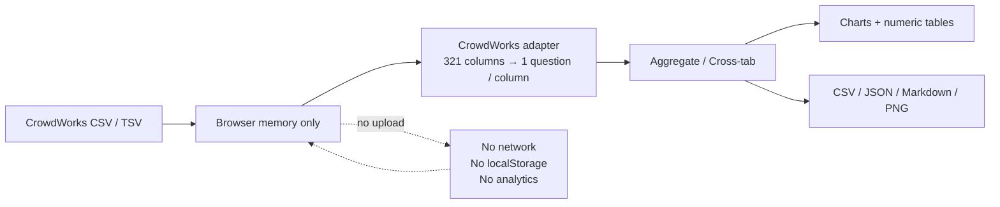

# CrowdWorks AI Work Survey Analyzer

English | [日本語](README.md)

A **fully local browser app** for aggregating, visualizing, cross-tabulating, and exporting survey CSV/TSV data.

The original use case was a survey conducted on **CrowdWorks**, a Japanese crowdsourcing platform,
about real paid work performed with generative AI.

The app also accepts ordinary CSV / TSV input.

- no external AI API
- no upload to an external server
- no analytics / telemetry
- no `localStorage`, `sessionStorage`, IndexedDB, or cookies
- loaded survey data lives in browser memory and disappears when the page is closed



**Survey responses are processed only in browser memory. They are not uploaded or persisted by the app.**

## What it does

### CSV / TSV import

- drag & drop
- file picker
- paste text directly
- automatic delimiter detection
- UTF-8 and Shift_JIS / CP932 support

### CrowdWorks CSV normalization

CrowdWorks exports choice questions in a platform-specific layout.

A single question may appear as:

```text
header: "1. Age" , ""
row:    "4"      , "45–54"
```

Multi-select questions repeat this pair for branches such as `12-1.`, `12-2.`, and so on.

A real source file used during development had **321 columns**.

The adapter converts that structure into a normal internal model:

> **one logical survey question = one logical column**

The raw response count does not change.

CrowdWorks-specific parsing is isolated in `src/core/adapters/crowdworks.ts`,
so aggregation / chart / crosstab / export code does not need to understand the platform-specific shape.

### Single-choice and multiple-choice aggregation

For each question, the denominator is:

> **the number of valid responses to that question**

not always the total number of survey rows.

Unanswered rows are excluded from that question's denominator.

For multiple-choice questions:

- counts are respondent-based
- duplicate occurrences of the same option within one respondent are deduplicated
- percentages may sum to more than 100%, which is expected

The denominator is displayed with the result.

### Charts + numeric tables

Charts are selected from bar / horizontal bar / pie / line based on question type.

Every chart is accompanied by the **same underlying numeric table**.

The design intentionally avoids making the chart the only source of truth.

### Cross-tabulation

Choose row and column questions and switch between:

- count
- row %
- column %
- total %

Cross-tabs use respondents who have valid answers to both selected questions.

Multiple-choice responses can contribute to multiple cells.

### Response exclusion

A response can be excluded from analysis without being deleted.

Excluded responses disappear from:

- aggregates
- charts
- crosstabs
- summary exports
- AI-facing Markdown

But `responses.csv` intentionally preserves all rows with an `included` column.

This separates:

> **exclude from analysis**

from:

> **erase the source record**

### Question selection

Questions can be selected or deselected for the main analysis / export surface.

This is separate from response inclusion.

For example:

- exclude response #12 → response #12 disappears from statistics
- deselect "Gender" → only that question disappears from selected outputs

### Exports

| File | Purpose |
|---|---|
| `summary.csv` | question / option counts and percentages |
| `cross-tab.csv` | current cross-tab |
| `responses.csv` | all responses + `included` for audit / reanalysis |
| `analysis.json` | machine-readable aggregated result |
| `survey-summary.md` | summary Markdown suitable for ChatGPT / Claude analysis |
| `survey-free-text.md` | included free-text responses for qualitative analysis |
| `<question>.png` | high-resolution chart image |

CSV exports use UTF-8 with BOM for Excel compatibility.

## Privacy and identity handling

This repository contains **no real survey response dataset**.

Samples and test fixtures are synthetic:

- deterministic generation with a fixed seed
- fictional worker names
- `example.invalid` for guaranteed non-real URLs
- real-data paths excluded through `.gitignore`

CrowdWorks management columns are treated separately from survey questions.

Examples:

- work / task id
- worker name
- worker profile URL
- approval timestamp

Personally identifying management fields are hidden by default and are structurally excluded from:

- summary statistics
- charts
- crosstabs
- `summary.csv`
- `analysis.json`
- `survey-summary.md`
- `survey-free-text.md`

They do not accidentally become "survey questions."

## Runtime network boundary

The standalone build includes a restrictive CSP such as:

```text
default-src 'none';
connect-src 'none';
form-action 'none';
object-src 'none';
```

The app also avoids runtime code paths such as:

- `fetch`
- `XMLHttpRequest`
- `WebSocket`
- `navigator.sendBeacon`
- external CDN dependencies

The goal is not only to say "local processing" in documentation,
but to keep the runtime architecture aligned with that claim.

## Free-text parsing: prefer "unparsed" over guessing

The original survey's work-time answer was free text and could contain values such as:

- `3時間` — 3 hours
- `1時間半` — 1.5 hours
- `約3時間` — about 3 hours

Those can be parsed under an explicit rule.

Other inputs are ambiguous:

- a bare `8` with no unit
- `3 weeks`
- `1 minute to apply, 3 minutes to do the task`

The analyzer does **not** grab the first number and call it the result.

If a value cannot be interpreted safely, the derived category becomes:

> `解析不能` — unparsed

It is not converted to zero and is not treated as missing.

The original text remains unchanged in `responses.csv`.

## Conservative AI-name normalization

Free-text AI tool names contain spelling variants.

The analyzer normalizes clear variants of the **same product**, for example:

- `chatgpt`
- `chat gpt`
- `チャットGPT`

→ ChatGPT

But it does not aggressively collapse ambiguous or historically distinct names:

- Bard is not automatically rewritten to Gemini
- bare Copilot is not guessed as GitHub Copilot or Microsoft Copilot
- OpenAI / GPT / GPT-4 are not automatically treated as identical to ChatGPT

The goal is to reduce obvious spelling noise without adding meaning that the respondent did not provide.

## Published survey analysis: scope matters

The public article based on this tool analyzed:

> **99 job records from 92 respondents**

not "99 independent people."

Seven respondents submitted two different job records.

One of the original 100 records was excluded from the article analysis because
the reported work timing and the reported AI product timeline could not be made mutually consistent.

That record was not "fixed" by guessing a different date or product.

The published article also avoided turning observed cross-tab differences into causal claims.

For example, if high-AI-usage jobs were more likely to be jobs the respondent said they would not have accepted without AI,
the article described that **association in this dataset** rather than claiming that higher AI usage caused the decision.

## Why average hourly pay was not the headline metric

The survey contained:

- free-text work-time answers
- some unit ambiguity
- one very large 210-hour answer
- compensation reported in bands rather than exact amounts for many records

An average hourly-rate figure can still be computed under assumptions,
but a single mean can hide those uncertainties.

The article therefore focused more directly on:

- compensation-band distribution
- share of work taking 3+ / 5+ / 10+ hours
- median work time
- explicit caveats about parsing and outliers

Being able to calculate a metric did not automatically make it the best headline metric.

## Build and use

Install dependencies:

```bash
npm install
```

Development server:

```bash
npm run dev
```

Build:

```bash
npm run build
```

The build produces:

- `dist/` — normal build output
- `dist-standalone/index.html` — single-file HTML that can be opened directly with `file://`

Generate deterministic sample data:

```bash
npm run sample
```

Tests:

```bash
npm test
npm run typecheck
```

## Tech stack

- TypeScript
- Vite
- Papa Parse
- Chart.js
- Vitest

Runtime dependencies are bundled with the build.
The app does not load them from a CDN at runtime.

## Repository structure

```text
src/core/                     parsing, schema inference, aggregation, crosstab logic
src/core/adapters/            platform-specific input normalization
src/core/mapping/             survey question profiles and aliases
src/export/                   CSV / JSON / Markdown / PNG export
src/ui/                       browser UI
sample/                       deterministic synthetic sample data
tests/                        synthetic fixtures and unit/integration tests
docs/SPEC.md                  detailed implementation contract (Japanese)
```

## Design boundaries

This is an analysis utility, not an automatic research-authoring system.

It deliberately does **not**:

- upload responses to an AI model automatically
- infer causality from a cross-tab
- silently rewrite inconsistent source answers
- convert ambiguous free text to zero
- treat every spelling variant as the same product
- expose worker identity in AI-facing summary exports
- hide denominators behind percentages

For the evidence behind those choices, see:

- [Design decisions](docs/design-decisions.en.md) — retrospective summary tied to the public article and specification
- [Implementation specification](docs/SPEC.md) *(Japanese)*
- [Published survey article](https://poimono.jp/articles/generative-ai-work-survey/) *(Japanese)*

## AI-assisted development

The implementation was developed with AI-assisted coding and analysis.

## License

MIT. See [LICENSE](LICENSE).
