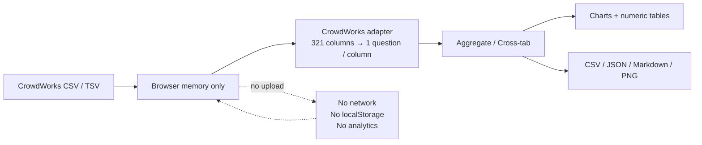

# CrowdWorks 生成AI仕事アンケート集計ツール

[English](README.en.md) | 日本語

CrowdWorks で実施した「生成AIを使って実際に行った仕事」アンケートの回答を、
**完全にローカルPC内だけ**で集計・可視化・エクスポートするブラウザアプリです。

このツールで集計した結果は、[「生成AIで仕事はどう変わる？クラウドソーシングの仕事99件を調査」](https://poimono.jp/articles/generative-ai-work-survey/)で公開しています。

- 外部AI API を使いません
- 回答データを外部サーバーへ送信しません
- analytics / telemetry を入れていません
- 回答データを localStorage 等へ保存しません（ブラウザを閉じれば消えます）



**回答データはブラウザのメモリ内だけで処理し、外部送信・永続保存をしません。**

---

## 主な機能

- **CSV / TSV の読み込み** — ドラッグ＆ドロップ、ファイル選択、テキスト貼り付け。
  区切り文字は自動判定。UTF-8 と Shift_JIS のどちらでも読めます。
- **CrowdWorks の実CSV形式に対応** — 選択肢が「番号列 + ラベル列」の2列セットで出る
  独自形式を自動検出し、通常の「1設問=1列」へ正規化します
- **単一回答・複数回答の集計** — 1セルに複数の選択肢が入る形式を分解して集計。
  割合の分母は常に「その設問の有効回答数」で、母数を必ず表示します
- **グラフ** — 縦棒 / 横棒 / 円 / 折れ線を自動選択。**グラフの下に必ず同じ内容の数値表**を出します
- **クロス集計** — 縦軸・横軸を自由に選択し、件数 / 行% / 列% / 全体% を切替
- **回答の除外** — 1件ずつ集計対象から外せます（除外分は表・グラフ・出力から消えます）
- **出力する設問の選択** — 記事や分析に使う設問だけをチェックで選べます
- **エクスポート** — `summary.csv` / `cross-tab.csv` / `responses.csv` /
  `analysis.json` / `survey-summary.md` / `survey-free-text.md` / 各グラフのPNG
- **AI へ渡せる出力** — `survey-summary.md` は ChatGPT や Claude にそのまま貼れる形式です

---

## データの取り扱い

**このリポジトリには実際のアンケート回答データを一切含めていません。**

- `sample/` のCSV/TSVは `scripts/generate-sample.mjs` が生成する**合成データ**です
  （固定シードで毎回同じ内容。実在の人物・回答とは無関係）
- `tests/fixtures/` のテストデータも**合成データ**です。
  作業者名は `ダミー作業者N`、URLは `example.invalid`（実在しないことが保証された予約ドメイン）を使っています
- 実データを扱うときは、ビルドしたアプリにローカルで読み込ませてください。
  読み込んだ回答はブラウザのメモリ上だけで処理され、外部へは送信されません
- CrowdWorks の管理列（作業ID / 作業者 / 作業者ページURL）は既定で非表示にしてあり、
  集計・グラフ・AI向け出力には一切載りません

実回答データをこのリポジトリへ置かないよう、`.gitignore` で
`*.private.csv` / `private/` / `real-data/` を除外しています。

---

## セットアップ

```bash
npm install
```

## 使い方

### 開発サーバーで使う

```bash
npm run dev
```

表示された `http://localhost:5173/` をブラウザで開きます。

### ビルドして使う

```bash
npm run build
```

- `dist/` … 通常のビルド成果物（`npm run preview` でローカル配信して使う）
- `dist-standalone/index.html` … JS/CSS を1枚に埋め込んだ単一HTML。
  **ダブルクリックして `file://` で直接開けます。**

ビルド成果物には次の CSP が埋め込まれ、実行時のネットワークアクセスが遮断されます。

```
default-src 'none'; script-src 'self' 'unsafe-inline'; style-src 'self' 'unsafe-inline';
img-src 'self' data: blob:; font-src 'self' data:; connect-src 'none';
form-action 'none'; base-uri 'none'; object-src 'none'
```

### サンプルデータの再生成

```bash
npm run sample
```

`sample/` 配下に決定論的（毎回同じ内容）のサンプルCSV/TSVを生成します。
個人情報は含みません。

### テスト・型チェック

```bash
npm test
```

```bash
npm run typecheck
```

---

## 画面の流れ

1. **データ読み込み** — CSV/TSV のドラッグ＆ドロップ、ファイル選択、テキスト貼り付け、サンプル読み込み
2. **サマリー** — 全回答数 / 集計対象 / 除外数、認識した列一覧
3. **回答一覧** — 1件ずつ「集計対象 / 除外」を切り替え。除外分は全ての表・グラフ・出力から外れます
4. **基本集計** — 質問ごとの度数分布表（母数を明記）。質問の種別をその場で変更可能
5. **グラフ** — 自動生成。**グラフの下に必ず元の数値表**を表示します
6. **クロス集計** — 縦軸・横軸を自由に選択。件数 / 行% / 列% / 全体% を切替
7. **出力する項目** — どの設問を集計・グラフ・AI向け出力に載せるかをチェックで選択
8. **エクスポート** — 下記のファイルを出力

---

## 出力する項目（設問の選択）

チェックした設問だけが次に反映されます。

- 基本集計の表示
- グラフの表示
- `summary.csv`
- `analysis.json` の `questions`
- `survey-summary.md`
- 「すべてのグラフをPNG保存」

`responses.csv` / `survey-free-text.md` / `cross-tab.csv` は監査・再分析用なので、
この選択の影響を受けません。

回答単位の「集計対象 / 除外」（`included`）とは**別の概念**です。

- 回答12を除外 → すべての統計から回答12が消える
- 「性別」のチェックを外す → 性別の集計だけが表示・主要出力から消える

## 識別情報・管理列

CrowdWorks の CSV に含まれる管理列（作業ID / 作業者名 / 作業者ページURL / 承認日時）は、
アンケートの設問とは別枠で扱います。

- `summary.csv` / `analysis.json` / `survey-summary.md` / `survey-free-text.md` /
  `cross-tab.csv` / グラフには**一切含めません**
- 出るのは**回答一覧**と `responses.csv` だけ
- 作業者名 / 作業者ページURL / 作業ID は**初期状態でOFF**。
  「7. 出力する項目」のチェックを入れたときだけ表示されます
- 承認日時は個人を特定しないため常に残します（集計には載りません）

チェックをOFFにすると `responses.csv` からも該当列が落ちます。
`No` 列と `included` 列は常に残るため、集計対象の切り替えには影響しません。

---

## エクスポートされるファイル

| ファイル | 用途 |
|---|---|
| `summary.csv` | 全質問の集計。`question,option,count,percentage,valid_responses,multiple_choice` |
| `cross-tab.csv` | 現在表示中のクロス集計 |
| `responses.csv` | **全回答**（除外分も残す）＋ `included` 列。監査・再確認用 |
| `analysis.json` | 全体集計の機械可読形式 |
| `survey-summary.md` | ChatGPT / Claude にそのまま貼れる Markdown（度数集計） |
| `survey-free-text.md` | 集計対象の自由記述の本文だけ。AI に定性分析させる用 |
| `<質問キー>.png` | 各グラフの高解像度PNG（記事用）。例 `age.png` `ai-tools.png` |

CSV は Excel 対応のため UTF-8 BOM 付きで出力します（`analysis.json` と `survey-summary.md` は BOM なし）。

グラフPNGは画面の表示倍率ではなくキャンバスの実ピクセルを基準に2倍で書き出すため、
1グラフあたり 1500〜2300px 程度の幅になります。
画面がダークテーマでも、PNGは白背景・濃色の文字で書き出します。

---

## 集計仕様（重要）

- **割合の分母は「その質問の有効回答数」** です。集計対象件数ではありません。
  未回答の人はその質問の分母から外れます。
- **複数回答は回答者ベース**で数えます。1人が同じ選択肢を2回書いても1回として数えます。
  そのため割合の合計は 100% を超えることがあります（正常です）。
- 除外した回答は、表・グラフ・クロス集計・`summary.csv` / `cross-tab.csv` /
  `analysis.json` / `survey-summary.md` / `survey-free-text.md` から外れます。
  **例外は `responses.csv` だけ**で、これは監査用に全回答を残し、
  末尾の `included` 列（`true` = 集計対象 / `false` = 除外）で区別します。
- 数値項目（報酬・作業時間・修正回数など）は「1万円」「12,000円」「3万5000円」のような
  日本語混じりの表記もパースします。パースできなかった件数は要約に併記します。

---

## CrowdWorks の実CSVについて

CrowdWorks からダウンロードしたアンケートCSVは、**そのままドラッグ＆ドロップ**できます。

CrowdWorks は選択式の設問を「1設問=1列」では出力せず、
**選択肢番号の列 + ヘッダーが空欄のラベル列**の2列セットで出します。

```
ヘッダー: "1. 年齢" , ""
データ  : "4"       , "45～54"
```

複数選択では選択肢ごとに2列セットが並びます（`12-1.` `12-2.` …）。
実ファイルはこの形で 321 列になります。

読み込み時に自動判定して、次のとおり正規化します。

- 分析に使うのは**右側の人間可読なラベル**。選択肢番号は捨てます
- 枝番付き（`12-1.` `12-2.` …）は1つの複数回答設問へ統合します
- 自由入力列（`11. 実際の作業時間` `13. 一番使ったAI` `23. 何かあればこちらへ`）は値をそのまま保持します
- 空ヘッダー列は単独の設問にしません
- 回答件数は変わりません

結果として **管理列4列 + アンケート23設問 + 派生年月** になり、
集計・グラフ・クロス集計・エクスポートは CrowdWorks 固有の構造を一切意識しません。

判定条件は「管理列4つ（作業ID / 作業者 / 作業者ページURL / 承認日時）が揃っていること」
かつ「`12-1.` のような枝番付き、または番号付きの直後が空ヘッダーの列があること」です。
条件を満たすと画面に **「CrowdWorks形式を検出しました」** と表示されます。
満たさない通常のCSV/TSVは従来どおり汎用パーサーで読み込みます。

CrowdWorks 固有の処理は `src/core/adapters/crowdworks.ts` に閉じ込めてあります。

実CSV（52回答 / 321列）で確認した設問の内訳は次のとおりです。

- 単一選択（枝番なしの2列セット）… Q1 年齢 / Q2 性別 / Q5 受注年 / Q6 受注月 /
  Q7 仕事の主なカテゴリ / Q9 契約・報酬形式 / Q10 報酬 / Q15〜Q22
- 複数選択（枝番付きの2列セット）… Q3 現在の職種 / Q4 サービス・経路 /
  Q8 具体的に行った仕事内容 / Q12 使用したAI・AIツール / Q14 AIを何に使ったか
- 自由入力（ペアにならない1列）… Q11 実際の作業時間 / Q13 一番使ったAI / Q23 自由記述

**Q7「仕事の主なカテゴリ」は単一選択**です（実CSVで52回答すべてが1ラベル）。

2列セットになっている設問は「用意された選択肢から選ぶ設問」だと構造的に確定するので、
値からの推定より優先して種別を固定します。
これがないと、`覚えていない` のような選択肢が混じった Q6 受注月が
「ほぼ数値・異なり13種」と見なされて数値集計に化けてしまいます。

### Q11「実際の作業時間」の派生質問

Q11 は自由入力で、1セルに2つの指標が改行で入っています。

```
- 作業日数：1日
- 合計作業時間：3時間
```

原文はそのまま保持したうえで、**確実に読み取れる場合だけ**
分析用の派生質問を2つ作ります。

| 派生質問 | 内容 |
|---|---|
| 作業日数（派生） | `1日` `2日` … の度数分布 |
| 合計作業時間（派生） | 30分未満 / 30分~1時間未満 / 1~2時間未満 / 2~3時間未満 / 3~5時間未満 / 5~10時間未満 / 10~20時間未満 / 20時間以上 |

読み取る形と読み取らない形は次のとおりです。

| | 読み取る | 読み取らない（解析不能） |
|---|---|---|
| 作業日数 | `1日` `１日` `一日` `3日` / ラベル直後の単独整数（`作業日数：2`） | `半日以下` `3週間` `3ヶ月 週5` |
| 合計作業時間 | `30分` `3時間` `5時間30分` `1時間半` `1時間半程` `約3時間` `1時間程度`（全角数字も可） | `合計作業時間：8`（単位なし）/ `応募に1分、作業に3分`（複数の時間が別々の意味） |

- 読み取れなかった回答は **0 や空欄にせず「解析不能」として数えます**。
  `summary.csv` / `analysis.json` / `survey-summary.md` に解析不能の件数が行として出るので、
  解析成功件数（有効回答数 − 解析不能）と分布が同じ表で分かります。
- Q11 が未回答の行は母数から外れます（「未回答」と「解析不能」は別扱い）。
- **元の Q11 は1文字も変更しません。** `responses.csv` には常に原文が出ます。
- 文章の途中から数字を拾うことはしません（別の意味の数値を拾う事故を防ぐため）。

### AI名の正規化方針

`13. 上記の中で一番使ったAIは何ですか？` は自由入力のため表記ゆれが実在します。
`profiles.ts` の `AI_TOOL_OPTION_ALIASES` で正規化していますが、
**寄せるのは「同じ製品の明らかな綴り違い」だけ**です。

| 寄せる | 寄せない（元表記のまま残す） |
|---|---|
| `chatgpt` / `chat gpt` / `チャットGPT` → ChatGPT | `OpenAI` / `GPT` / `GPT-4` / `GPT4` |
| `gemini` / `google gemini` → Gemini | `Bard`（当時の名称として保持） |
| `claude` / `claude ai` → Claude | 単独の `Copilot`（GitHub か Microsoft か判断できない） |
| `github copilot` → GitHub Copilot | `Adobe` など製品が特定できないもの |
| `microsoft copilot` → Microsoft Copilot | 回答になっていない文（例: 感想がそのまま入力されたもの） |

`Bard` を `Gemini` に寄せないのは、受注年月との時系列比較で
「その時点で使われていた名称」が必要になるためです。
Google系としてまとめたい場合は、集計後の分析側で行ってください。

---

## CrowdWorks の実データに合わせる方法

列名のマッピングは `src/core/mapping/profiles.ts` の `CROWDWORKS_PROFILES` にまとまっています。

実際の列名が自動認識されなかった場合の対応は2通りです。

1. **その場で直す** — 画面の「基本集計」で質問ごとの種別（単一選択／複数選択／数値／自由記述／対象外）を変更する
2. **恒久的に直す** — `profiles.ts` の該当プロファイルの `aliases` に実際の列名（の一部）を追加する

新しい設問が増えた場合は `CROWDWORKS_PROFILES` に1件追加するだけで、
表示ラベル・グラフ種別・選択肢の並び順まで反映されます。

---

## 技術構成

- [Vite](https://vite.dev/) + TypeScript（strict）
- [Papa Parse](https://www.papaparse.com/) — CSV/TSV パース
- [Chart.js](https://www.chartjs.org/) — グラフ描画
- Vitest — ユニットテスト

ランタイムの依存は Papa Parse と Chart.js の2つだけで、どちらもビルド成果物に同梱されます。
CDN から実行時にライブラリを取得する構成にはしていません。

ディレクトリ構成と各モジュールの契約は [docs/SPEC.md](docs/SPEC.md) を参照してください。

データの扱いと記事上の主張に関する判断は、[docs/design-decisions.md](docs/design-decisions.md) に公開記事・仕様書への根拠リンク付きでまとめています。
